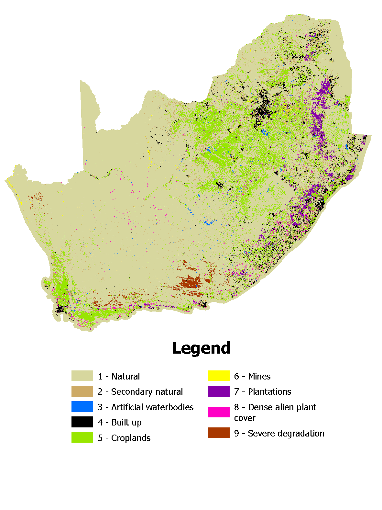

## Workflow for combining a 7 class version of the national land cover of South Africa (2022) with invasive plant data and ecosystem condition data to produce an 8 and a 9 class land cover raster.

Date: 26 February 2026

Author: A.L. Skowno

DOI: https://zenodo.org/records/19125515 

### Summary

*This workflow combines national data on invasive plant species (2023) with a 7 class version of the national land cover of South Africa (2022). The resulting raster has 8 classes (nlc2022_8class_niaps.qmd). This 8 class raster is then combined with various ecosystem condition data sets to make a 9 class national land cover raster (nlc2022_9class_niaps_cond.qmd).*

### Input data

-   South African National Land Cover data set for [2022](https://www.dffe.gov.za/egis) (prepared by the National Department of Forestry, Fisheries and the Environment) has 72 classes, these were are reclassified to 7 classes in ARCGIS PRO as follows: 1 = Natural or near natural ecosystem classes; 2 = Secondary natural area (old fields, abandoned land, in an additional step - all pixels that were cropland or mine or built up between 1990 and 2020, but in 2022 are reflected as "natural" - are reclassified to this class); 3 = Artificial water body (dams and water treatment); 4 = Built up (rural villages, urban, industrial, commercial and infrastructure, including small holdings); 5 = Cropland (commercial and subsistence and mixed farming of field crops and horticultural crops); 6 = Mines and some mine tailings dams; 7 = Plantation forestry (alien timber and pulp plantations and non commercial woodlots, including some windbreaks).

-   National Invasive Alien Plant Survey (NIAPS) ([Kotzé et al. 2025](#0)) estimated the extent of the most-widespread & abundant, terrestrial invasive alien plant taxa (approx. 32 species) in South Africa. Data were downloaded from an ARCPRO package available [here](#0). Each raster has pixel values (0-100) that represent the area invaded divided by condensed area invaded for 32 Invasive plant taxa organised into 13 rasters. Values of 100 represent 100% invasion (effectively 100% canopy cover of the specific invasive species) (see [Marais et al. 2004](https://journals.co.za/doi/10.10520/EJC96205)) for explanation of the concept of "condensed area"). Note the data is unprojected (EPSG 4326).

-   **City of Cape Town land cover and ecosystem condition -** City of Cape Town Biodiversity Network (supplied by CoCT, 2024). Data supplied in ESRI gdb format, converted to a TIFF in ARCGIS PRO, unprojected vector data rasterized and to match 20m and Albers Equal Area national land cover grid. Reclassified to match the NLC 7class, with severely degraded areas (referred to as "poor" condition in source data) given value = 8 and estimated to have severity of \>80%. Impacts occurred more than 50 years ago.

-   **Nelson Mandela Bay Metro land cover and ecosystem condition -** Nelson Mandela Bay degradation data (supplied by Stewart et al., 2015) (prepared in ARCGIS PRO, 8 = severely degraded class from NMB degradation, 4 = builtup, 0 = unknown). Class 8 (degradation) is estimated to be equivalent to 80% severity on RLE Criterion D - factors include overgrazing / browsing, fuel wood collection, bush clearing (to promote grazing), resulting in severe reduction in natural tree or shrub cover, changes in species composition (palatable species usually dominant have been lost), increase in bare ground fraction (with soil loss). Impacts occurred more than 50 years ago.

-   **Subtropical Ecosystem Project (STEP) thicket ecosystem condition -** Sub Tropical Ecosystem Project (STEP) Thicket degradation layer ([Lloyd et al., 2002](https://www.researchgate.net/profile/Anthony-Palmer-6/publication/229078462_Patterns_of_Transformation_and_Degradation_in_the_Thicket_Biome_South_Africa/links/0c960525fad8d20b86000000/Patterns-of-Transformation-and-Degradation-in-the-Thicket-Biome-South-Africa.pdf)) (prepared in ARCGIS PRO, 8 = severely degraded class from STEP.) This class is estimated to be equivalent to 80% severity on RLE Criterion D - factors include overgrazing / browsing resulting in severe reduction in shrub canopy cover, changes in species composition (loss of *Portulacaria afra* (spekboom) and other palatable species usually dominant), increase in bare ground fraction (with soil loss). Impacts occurred more than 50 years ago, and subtropical thicket does not recover naturally over time - rather it enters a alternative stable state - an arid shrubland dominated by Asteraceae typical of the Nama Karoo biome.

-   **Little Karoo ecosystem condition (Thompson 2009) -** Little Karoo degradation map developed in 2009 ([Thompson et al., 2009](https://doi.org/10.1007/s00267-008-9228-x)). The severely degraded class from this data is estimated to be equivalent to 80% severity on RLE Criterion D - factors include overgrazing / browsing resulting in severe reduction in shrub canopy cover, changes in species composition (loss of palatable species usually dominant), increase in bare ground fraction (with soil loss). Most impacts occurred more than 50 years ago, and in this arid region the shrubland does not recover naturally over time - rather it enters an alternative stable state - bare ground with annual grass and herbs following rainfall events - limited perennial cover).

-   **Hardeveld degradation study and ecosystem condition -** The Hardeveld Bioregion degradation map developed in 2021 ([Bell, et al. 2021](https://doi.org/10.1002/ldr.3900)). The severely degraded class (degradation archetype = Well Below Average) was estimated to be equivalent to 80% severity on RLE Criterion D - factors include overgrazing / browsing resulting in severe reduction in shrub canopy cover, changes in species composition (loss of palatable species usually dominant), increase in bare ground fraction (with soil loss). Most impacts occurred more than 50 years ago, and in this arid region the perennial shrub cover recover readily, rather it enters an alternative stable state - bare ground with annual grass and herbs following rainfall events).

-   **Little Karoo degradation study and ecosystem condition (Kirsten 2023) -** The Little karoo degradation map developed in 2023 ([Kirsten, et al. 2023](https://doi.org/10.1016/j.jaridenv.2023.105066)). The severely degraded class (degradation archetype = Well Below Average) was estimated to be equivalent to 80% severity on RLE Criterion D - factors include overgrazing / browsing resulting in severe reduction in shrub canopy cover, changes in species composition (loss of palatable species usually dominant), increase in bare ground fraction (with soil loss). Most impacts occurred more than 50 years ago, and in this arid region the perennial shrub cover recover readily, rather it enters an alternative stable state - bare ground with annual grass and herbs following rainfall events).

#### Data preparation

Each raster in the NIAPS dataset has pixels values of 0-100, effectively representing the percentage invasive species canopy cover. Summing the rasters results in an overall invasive canopy cover value for each pixel. Pixels with summed values greater than 100 are considered 100% invaded. The summed results were then binned into 10 invasion classes. To proceed with analysis the summed invasive raster is then resampled and projected to match the land cover raster. For the condition data the data preparation was conducted in ARCGIS PRO.

#### Analysis

**8 classes NLC:**

Combine the 7 class national land cover 2022 and NIAPS data such that IF the 7 class land cover is "natural" (VALUE =1) AND the NIAPS value is greater than or equal to 5 (ie 50% canopy cover of invasive plants or greater) THEN pixel is recoded as "invaded" (assigned VALUE = 8) ELSE the pixel retains its NLC2022 value.

**9 class NLC:**

Combine the 8 class national land cover (above) with each condition layer sequentially such that if the 8 class nlc is "natural" (VALUE = 1) AND any of the condition layers are severely degraded (VALUE = 8), THEN pixel is recoded as "severely degraded" (VALUE = 9).

#### **Output**
Available at  https://zenodo.org/records/19125515 

**File: nlc2022_8class_niaps50.tif**

Format: GeoTiff

Resolution: 20m x 20m

Projection: Albers Equal Area Conic, central meridian = 25; std parallel1 = -24; std parallel2 = -33, Spheroid = WGS84

Values: Integer 1 - 8 (1 = natural, 2 = secondary natural, 3 = artificial water, 4 = built up, 5 = cropland, 6 = mine, 7 = plantation, 8 = invasive plants \>50% cover).

**File: nlc2022_9class_niaps_cond.tif**

Format: GeoTiff

Resolution: 20m x 20m (also 100m version)

Projection: Albers Equal Area Conic, central meridian = 25; std parallel1 = -24; std parallel2 = -33, Spheroid = WGS84

Values: Integer 1 - 8 (1 = natural, 2 = secondary natural, 3 = artificial water, 4 = built up, 5 = cropland, 6 = mine, 7 = plantation, 8 = invasive plants \>50% cover, 9 = severe degradation (overgrazing/disturbance)).

{width="600"}

