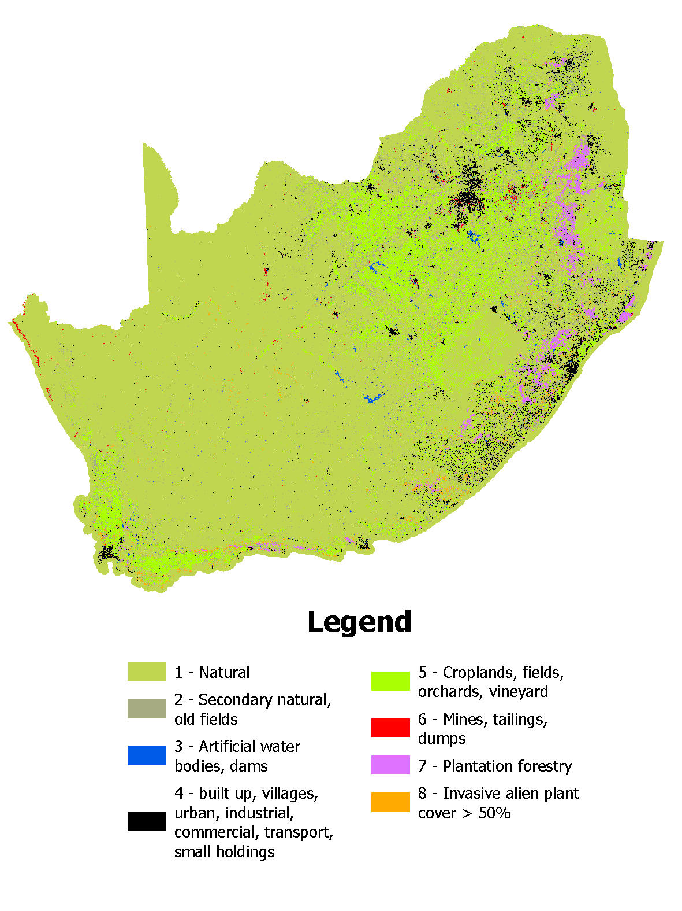

## Workflow for combining invasive plant data (2024) with a 7 class version of the national land cover of South Africa (2022), to produce an 8 class land cover raster.

Date: 26 February 2026

Author: A.L. Skowno

### Summary

*This workflow combines national data on invasive plant species (2023) with a 7 class version of the national land cover of South Africa (2022). The resulting raster layer carries a CC-BY license and can be used in spatial analysis.*

The National Invasive Alien Plant Survey (NIAPS) produced by the Department of Forestry, Fisheries and the Environment and Stellenbosch University ([Kotzé et al. 2025](#0)), resulted in a series of raster data sets that contain distribution and abundance of selected invasive plant taxa across South Africa (mainland). This data was summarised into a single raster equivalent to invasive alien plant canopy cover percentage, and then combined with a 7 class version of National Land Cover 2022, to form an 8 class land cover raster.

### Data

-   South African National Land Cover data set for [2022](https://www.dffe.gov.za/egis) (prepared by the National Department of Forestry, Fisheries and the Environment) has 72 classes, these were are reclassified to 7 classes in ARCGIS PRO as follows:

1.  = Natural or near natural ecosystem classes

2.  = Secondary natural area (old fields, abandonded land, in an additional step - all pixels that were cropland or mine or built up between 1990 and 2020, but in 2022 are reflected as "natural" - are reclassified to this class)

3.  = Artificial water body (dams and water treatment)

4.  = Built up (rural villages, urban, industrial, commercial and infrastructure, including small holdings)

5.  = Cropland (commercial and subsistence and mixed farming of field crops and horticultural crops)

6.  = Mines and some mine tailings dams

7.  = Plantation forestry (alien timber and pulp plantations and non commercial woodlots, including some windbreaks)

-   National Invasive Alien Plant Survey (NIAPS) ([Kotzé et al. 2025](#0)) estimated the extent of the most-widespread & abundant, terrestrial invasive alien plant taxa (approx. 32 species) in South Africa. Data were downloaded from an ARCPRO package available [here](#0). Each raster has pixel values (0-100) that represent the area invaded divided by condensed area invaded for 32 Invasive plant taxa organised into 13 rasters. Values of 100 represent 100% invasion (effectively 100% canopy cover of the specific invasive species) (see [Marais et al. 2004](https://journals.co.za/doi/10.10520/EJC96205)) for explanation of the concept of "condensed area"). Note the data is unprojected (EPSG 4326).

#### Data preparation

Each raster in the NIAPS dataset has pixels values of 0-100, effectively representing the percentage invasive species canopy cover. Summing the rasters results in an overall invasive canopy cover value for each pixel. Pixels with summed values greater than 100 are considered 100% invaded. The summed results were then binned into 10 invasion classes. To proceed with analysis the summed invasive raster is then resampled and projected to match the land cover raster.

#### Analysis

Combine the NLC2022 and NIAPS data such that IF the land cover is "natural" (VALUE =1) AND the NIAPS value is greater than or equal to 5 (ie 50% canopy cover of invasive plants or greater) THEN pixel is categorised as "invaded" (assigned VALUE = 8) for pixels values greater than 1 (all other land cover classes) ELSE the pixel retains its NLC2022 value.

**Output**

File: nlc2022_8class_niaps50.tif (also \_100m)

Format: GeoTiff

Resolution: 20m x 20m (also 100m version)

Projection: Albers Equal Area Conic, central meridian = 25; std parallel1 = -24; std parallel2 = -33, Spheroid = WGS84

Values: Integer 1 - 8 (1 = natural, 2 = secondary natural, 3 = artificial water, 4 = built up, 5 = cropland, 6 = mine, 7 = plantatio, 8 = invasive plants \>50% cover).

{width="400"}

